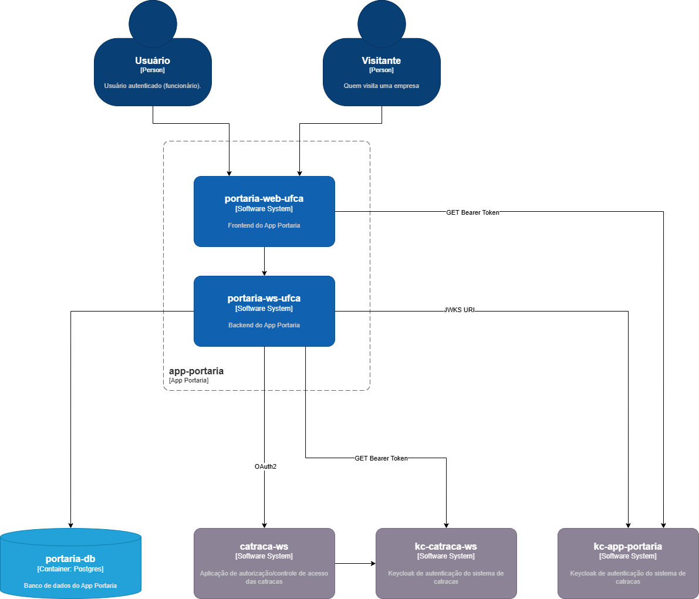
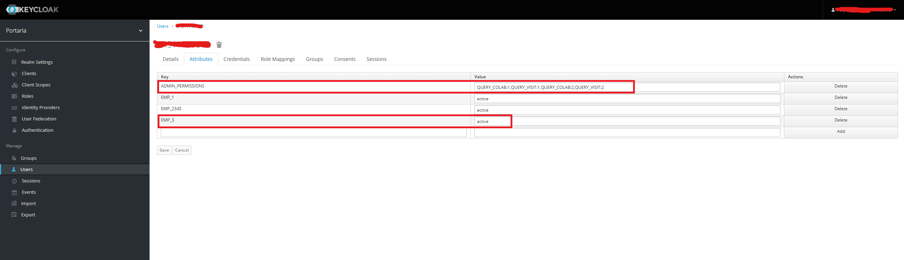
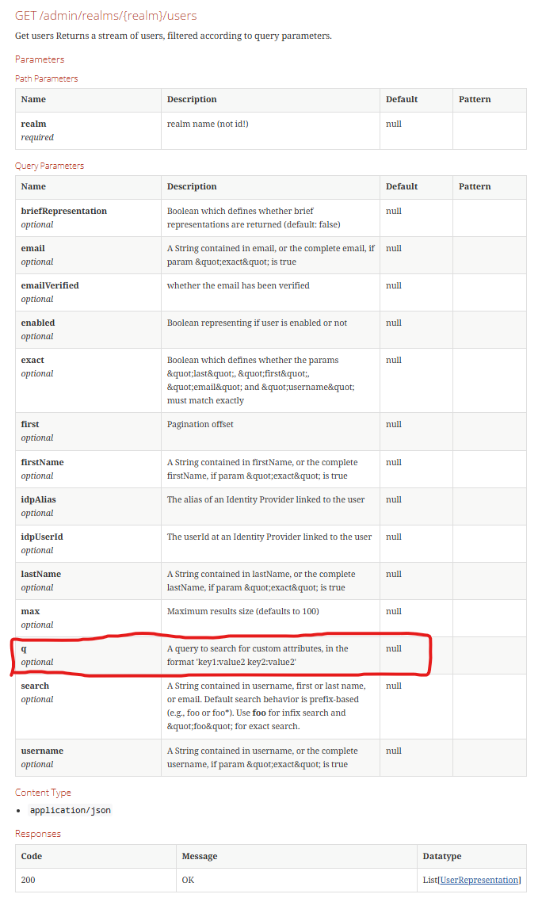

# App Portaria

Este é o repositório do backend do App Portaria.

# Arquitetura



# Pré-requisitos

- Java JDK 21

# Variáveis de ambiente

- DB_URL: URL do banco de dados postgres.
- DB_USR: usuário do banco de dados postgres.
- DB_PWD: senha do banco de dados postgres.
- JWKS_URI_APP_PORTARIA: JWKS URI do realm do Keycloak referente ao App Portaria.
- CLIENT_ID_KC_CATRACA_WS: Client ID do cliente Keycloak do Web Service de autorização das catracas.
- CLIENT_SECRET_KC_CATRACA_WS: Client Secret do cliente Keycloak do Web Service de autorização das catracas.
- AUTH_METHOD_KC_CATRACA_WS: Método de Autenticação do cliente Keycloak do Web Service de autorização das catracas. Ex: client_secret_post.
- GRANT_TYPE_KC_PORTARIA: Grant Type do cliente Keycloak do Web Service de autorização das catracas. Ex: client_credentials.
- CLIENT_ID_KC_PORTARIA: Client ID do cliente Keycloak do App Portaria.
- CLIENT_SECRET_KC_PORTARIA: Client Secret do cliente Keycloak do App Portaria.
- AUTH_METHOD_KC_PORTARIA: Método de Autenticação do cliente Keycloak do App Portaria. Ex: client_secret_post.
- GRANT_TYPE_KC_PORTARIA: Grant Type do cliente Keycloak do App Portaria. Ex: client_credentials. 
- ISSUER_URI_KC_CATRACA_WS: Issuer URI do Keycloak do App Catraca.
- ISSUER_URI_KC_PORTARIA: Issuer URI do cliente Keycloak do Web Service de autorização das catracas. 
- URL_CATRACAS_WS: URL do Web Service das Catracas.
- URL_KC_PORTARIA: URL do realm do Keycloak do App Portaria.
- AUTH_URL_KC_PORTARIA: Auth URL do realm do Keycloak do App Portaria.
- CLIENT_ID_KC_PORTARIA: Client ID do cliente do Keycloak do App Portaria.

# Permissões no Keycloak

As permissões de cada usuário na aplicação ficam registradas nos atributos do usuário no seguinte padrão:

| Nome do atributo  | Valor                       | Descrição                                                                |
|-------------------|-----------------------------|--------------------------------------------------------------------------|
| EMP_<NRO_EMPRESA> | active                      | Informa que o usuário tem permissão para gerar QR Code para esta empresa |
| ADMIN_PERMISSIONS | \<PERMISSION>:<NRO_EMPRESA> | Informa as permissões que o usuário tem para aquela empresa.             |



Permissões: 
- QUERY_COLAB: listar usuários
- QUERY_VISIT: listar visitas

Foi escolhida a abordagem de atributos pela possibilidade de filtrar usuários de uma empresa via REST, evitando trazer todos os usuário para o backend de forma desnecessária, 
conforme descrito na documentação do Keycloak.



# Rodar o projeto localmente

- Definir os valores das variáveis de ambiente;
- Executar o projeto com o maven:
```bash
./mvnw spring-boot:run
```

# Swagger

Após rodar o projeto localmente, a documentação do Swagger pode ser consultada através do link:

http://localhost:8080/portaria/api/swagger-ui/index.html